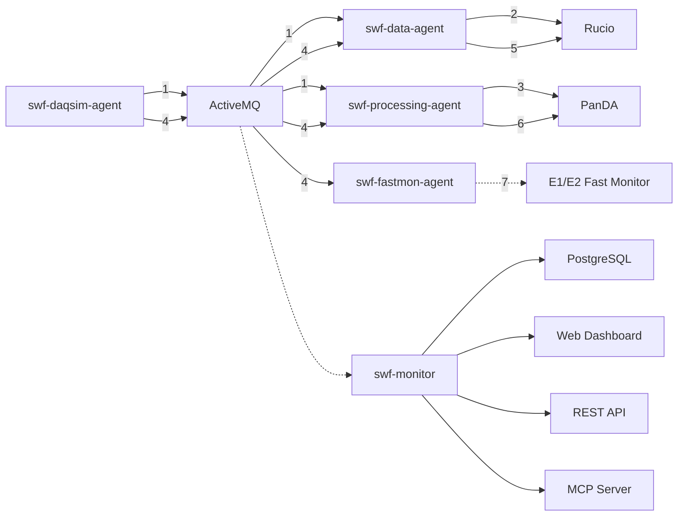
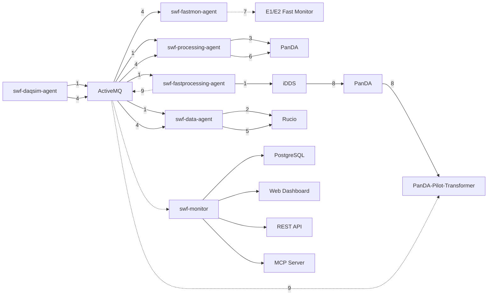
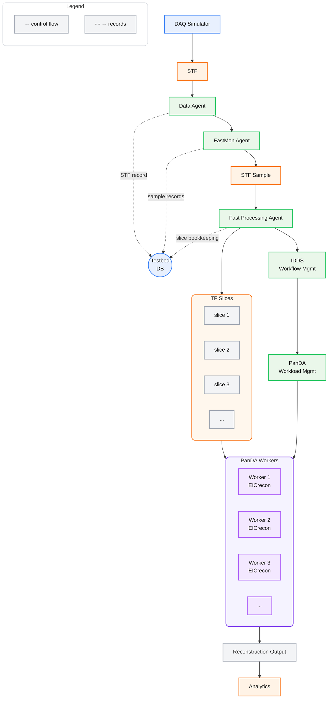

## 1. current architecture

**Workflow Steps:**
1. **Run Start** - daqsim-agent generates a run start broadcast message indicating a new datataking run is beginning
2. **Dataset Creation** - data-agent sees the run start message and has Rucio create a dataset for the run
3. **Processing Task** - processing-agent sees the run start message and establishes a PanDA processing task for the run
4. **STF Available** - daqsim-agent generates a broadcast message that a new STF data file is available
5. **STF Transfer** - data-agent sees the message and initiates Rucio registration and transfer of the STF file to E1 facilities
6. **STF Processing** - processing-agent sees the new STF file in the dataset and transferred to the E1 by Rucio, and initiates a PanDA job to process the STF
7. **Fast Monitoring** - fastmon-agent sees the broadcast message that a new STF data file is available and performs a partial read to inject a data sample into E1/E2 fast monitoring

*Figure: Testbed agent architecture and data flow diagram*

## 2. With PanDA/iDDS

**Workflow Steps:**
1. **Run Start** - daqsim-agent generates a run start broadcast message indicating a new datataking run is beginning
2. **Dataset Creation** - data-agent sees the run start message and has Rucio create a dataset for the run
3. **Processing Task** - processing-agent sees the run start message and establishes a PanDA processing task for the run
4. **STF Available** - daqsim-agent generates a broadcast message that a new STF data file is available
5. **STF Transfer** - data-agent sees the message and initiates Rucio registration and transfer of the STF file to E1 facilities
6. **STF Processing** - processing-agent sees the new STF file in the dataset and transferred to the E1 by Rucio, and initiates a PanDA job to process the STF
7. **Fast Monitoring** - fastmon-agent sees the broadcast message that a new STF data file is available and performs a partial read to inject a data sample into E1/E2 fast monitoring
8. **PanDA worker** - iDDS sees the run start message and creates PanDA transformer workers (A transformer in running PanDA Pilots)
9. **TF slice** - fast-processing-agent generates TF slices and distributes them to ActiveMQ. The transformer in PanDA Pilot consumes TF slice messages to process the payloads.

## 3. flow

