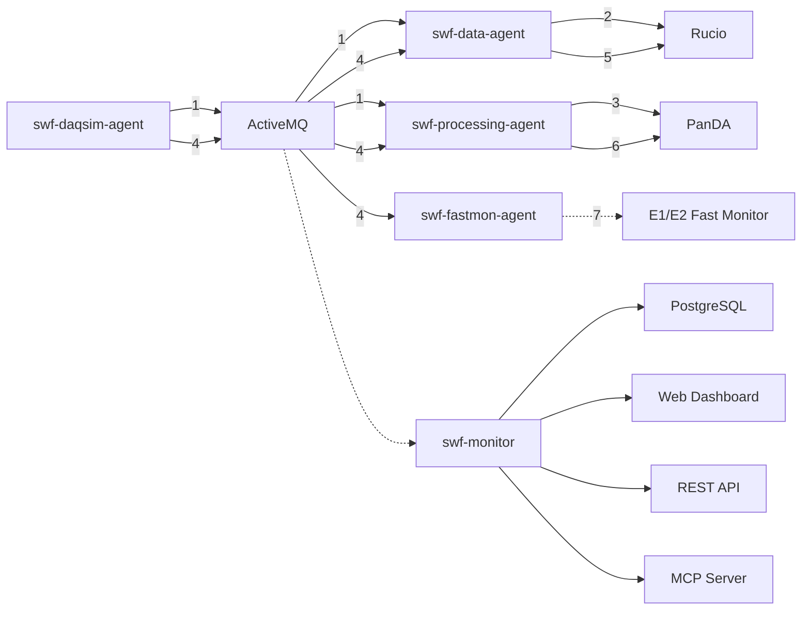

```mermaid
graph LR
    DAQ[E1/E2 Fast Monitor]
    PanDA[PanDA]
    Rucio[Rucio]
    ActiveMQ[ActiveMQ]
    PostgreSQL[PostgreSQL]
    DAQSim[swf-daqsim-agent]
    DataAgent[swf-data-agent]
    ProcAgent[swf-processing-agent]
    FastMon[swf-fastmon-agent]
    Monitor[swf-monitor]
    WebUI[Web Dashboard]
    RestAPI[REST API]
    MCP[MCP Server]
    
    DAQSim -->|1| ActiveMQ
    ActiveMQ -->|1| DataAgent
    ActiveMQ -->|1| ProcAgent
    DataAgent -->|2| Rucio
    ProcAgent -->|3| PanDA
    
    DAQSim -->|4| ActiveMQ
    ActiveMQ -->|4| DataAgent
    ActiveMQ -->|4| ProcAgent
    ActiveMQ -->|4| FastMon
    
    DataAgent -->|5| Rucio
    ProcAgent -->|6| PanDA
    FastMon -.->|7| DAQ
    
    ActiveMQ -.-> Monitor
    Monitor --> PostgreSQL
    Monitor --> WebUI
    Monitor --> RestAPI
    Monitor --> MCP
```

*Figure: Testbed agent architecture and data flow diagram*
